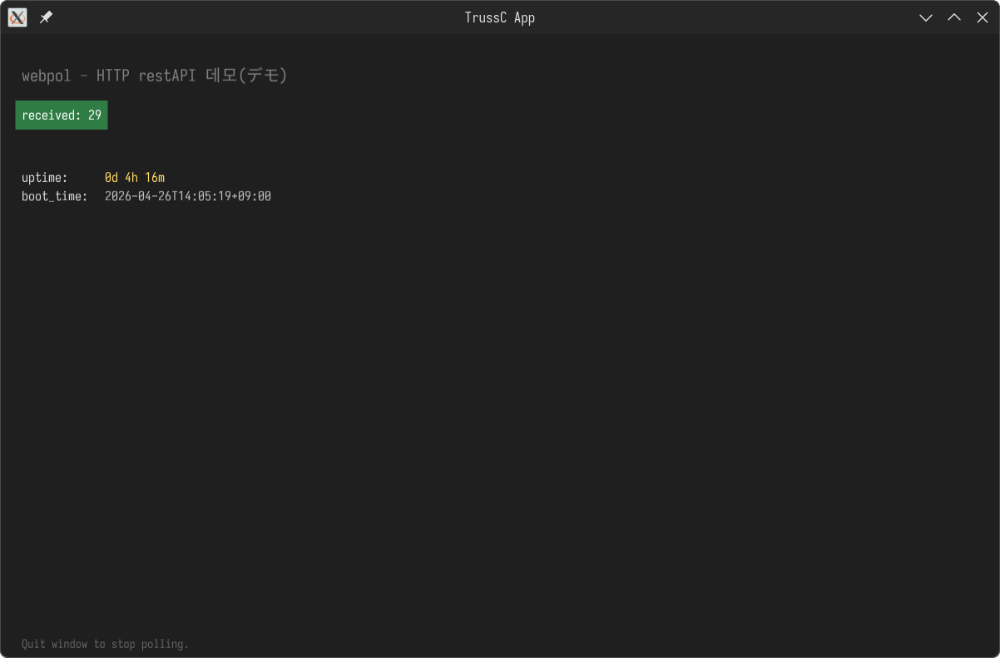

# tcxLabel

> **English** | [한국어](README.ko.md)



*A TrussC app rendering Korean (`데모`), Japanese (`デモ`), a green
`drawTextWithBackground` badge, and monospace tabular columns — all from
the bundled font.*

A drop-in replacement for TrussC's bitmap font, making `label` (text rendering)
easy to use. A header-only wrapper around TrussC's `tc::Font` that adds
per-size font caching, alignment, and styled background boxes.

## Features

- Header-only — just `#include <tcxLabel.h>`
- Automatic per-size `tc::Font` loading and caching
- CJK glyphs (Korean / Chinese / Japanese) + Nerd Font icons + monospace in a single bundled font (Sarasa Fixed K Nerd Font)
- Bundled font is auto-copied into `bin/data/fonts/` at CMake configure time
- `TextStyle` based styling: alignment, background fill, padding

## Bundled Font

[Sarasa Fixed K Nerd Font](https://github.com/jonz94/Sarasa-Gothic-Nerd-Fonts)
— a monospaced Korean (K) variant of Sarasa Gothic patched with Nerd Fonts icons.

Sarasa Gothic covers the full CJK Unified Ideographs range, so **Korean,
Chinese (Simplified / Traditional), and Japanese** all render out of the box.
The "K" variant prefers **Korean-style glyph shapes** for ideographs shared
across CJK (Han Unification) — fine for Korean-leaning UIs. If your app is
primarily Chinese or Japanese, grab the J / SC / TC variant from the
[Sarasa-Gothic-Nerd-Fonts releases](https://github.com/jonz94/Sarasa-Gothic-Nerd-Fonts/releases)
and swap it in via [`tcx::label::setFont()`](src/tcxLabel.h).

Bundled file: [data/fonts/sarasa-fixed-k-regular-nerd-font.ttf](data/fonts/sarasa-fixed-k-regular-nerd-font.ttf)

## Usage

```cpp
#include <tcxLabel.h>

void setup() override {
    tcx::label::setFont(TCX_LABEL_FONT_DEFAULT, 16);
}

void draw() override {
    tcx::label::drawText("Hello 한글", 20, 30);

    tcx::label::drawTextWithBackground(
        "status: OK", 20, 60,
        colors::white, colors::darkGreen, /*padding*/ 6.0f);
}
```

Style-based:

```cpp
tcx::label::TextStyle s;
s.textColor = colors::white;
s.bgColor   = colors::black;
s.padding   = 8.0f;
s.size      = 24;
s.hAlign    = tc::Center;
tcx::label::drawText("centered", 100, 100, s);
```

## CMake

In a consuming project:

```cmake
add_subdirectory(addons/tcxLabel)
target_link_libraries(<your_target> PRIVATE tcxLabel)
```

At configure time, files under `data/fonts/` (the `.ttf`, plus `OFL.txt` and
`NOTICE.md`) are copied into `${CMAKE_SOURCE_DIR}/bin/data/fonts/`.

## License

Addon code: **MIT** — see [LICENSE](LICENSE).

Bundled font: **SIL Open Font License 1.1** —
see [data/fonts/OFL.txt](data/fonts/OFL.txt) and [data/fonts/NOTICE.md](data/fonts/NOTICE.md).

Because CMake copies the OFL text and NOTICE alongside the font, consuming
projects automatically satisfy the OFL redistribution requirements.
